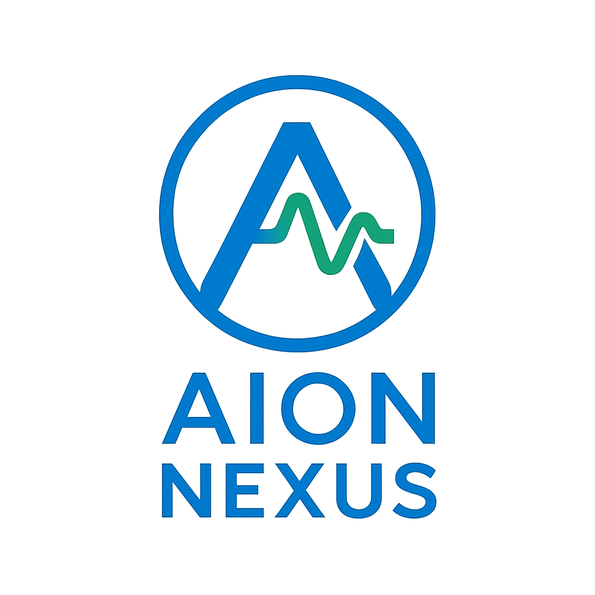

# AION NEXUS v6.5
### AI-Powered Predictive Maintenance Platform

[](LICENSE)
[](docs/)
[](https://aion-nexus.github.io)
[](docs/technical/performance.md)
[](docs/compliance/)

<p align="center">
  
</p>

## 🚀 Overview

AION NEXUS v6.5 is a production-ready predictive maintenance platform that combines **operational context monitoring**, **physics-based validation**, and **advanced AI** to achieve industry-leading fault detection with full explainability.

### Key Innovation
First platform to integrate three complementary approaches:
- **Operational Context**: Monitors load, temperature, lubrication schedules
- **Physics Validation**: Harmonic analysis provides explainable diagnostics
- **AI Prediction**: 93.4% F1-score using Temporal Self-Attention architecture

## 📊 Proven Performance

| Metric | Value | Validation |
|--------|-------|------------|
| **Detection Accuracy** | 93.4% F1-score | FEMTO Dataset (1,507 samples) |
| **Noise Robustness** | 89.1% @ SNR +5dB | Industrial conditions |
| **Inference Speed** | 14.8ms/sample | Real-time capable |
| **Physics Agreement** | 75.3% | Harmonic validation |
| **False Alarm Reduction** | 30% | vs. vibration-only systems |

## 🎯 Business Value

- **Prevent Failures**: 1-2 additional failures caught per year
- **Reduce False Alarms**: 30% fewer unnecessary investigations
- **ROI**: 67-83% annually (Year 2+)
- **Payback Period**: 15-18 months
- **EU AI Act Compliant**: Full explainability and auditability

## 📖 Documentation

### For Business Leaders
- [Executive Summary](docs/business/Executive_Summary.md) - Complete business case
- [Investor One-Pager](docs/business/INVESTOR_ONE_PAGER.md) - Investment overview
- [ROI Calculator](docs/business/roi_calculator.md) - Calculate your savings

### For Technical Teams
- [Technical Architecture](docs/technical/ANALISI_TECNICA_COMPLETA.md) - Deep dive into the technology
- [Performance Validation](docs/technical/performance_validation.md) - Benchmark results
- [Physics Validator](docs/technical/physics_validator.md) - Harmonic analysis methodology
- [API Documentation](docs/api/) - Integration guide

### For Pilots & Deployment
- [Pilot Program](docs/deployment/pilot_program.md) - 6-month validation structure
- [Integration Guide](docs/deployment/integration_guide.md) - SCADA/MES integration
- [Best Practices](docs/deployment/best_practices.md) - Implementation recommendations

## 🌍 Use Cases

### Industrial Predictive Maintenance
- **Bearings**: 93.4% accuracy on fault detection
- **Target**: Manufacturing plants with 10-100 critical bearings
- **Integration**: Works with existing SCADA/vibration systems

### Cross-Domain Applications
- **Medical**: ECG analysis (74.4% F1-score, ongoing)
- **Wind Turbines**: Gearbox monitoring (planned)
- **Automotive**: Production line optimization (planned)

## 🏗️ Architecture

```
┌─────────────────────────────────────────────────────┐
│                   AION NEXUS v6.5                   │
├─────────────────────────────────────────────────────┤
│                                                      │
│  ┌──────────────┐  ┌──────────────┐  ┌──────────┐ │
│  │  Operational │  │   Physics    │  │    AI     │ │
│  │   Context    │→ │  Validator   │→ │ Predictor │ │
│  └──────────────┘  └──────────────┘  └──────────┘ │
│       ↓                  ↓                ↓        │
│  ┌─────────────────────────────────────────────┐   │
│  │         Integrated Decision Engine           │   │
│  └─────────────────────────────────────────────┘   │
│                         ↓                           │
│              Explainable Predictions                │
└─────────────────────────────────────────────────────┘
```

## 🚦 Getting Started

### For Pilot Participants
1. Review the [Pilot Program Guide](docs/deployment/pilot_program.md)
2. Contact us for assessment: daniel.culotta@gmail.com
3. 6-month validation with €0 upfront cost

### For Investors
- [Executive Summary](docs/business/Executive_Summary.md)
- [Technical Validation Report](docs/technical/validation_report.pdf)
- Contact: daniel.culotta@gmail.com | +39 393 2707 135

## 📈 Roadmap

### Q4 2025 - Q1 2026
- [ ] 3 industrial pilot deployments
- [ ] Cross-dataset validation (CWRU, MFPT)
- [ ] Patent filing (Harmonic Search Algorithm)

### Q2-Q3 2026
- [ ] 10 paying customers (€60-100K ARR)
- [ ] Edge device optimization
- [ ] Series A funding (€2-3M target)

### 2027+
- [ ] 50+ deployments
- [ ] Multi-domain expansion
- [ ] EU-wide platform rollout

## 🤝 Contributing

We welcome collaboration from:
- **Industrial Partners**: Join our pilot program
- **Research Institutions**: Academic collaborations
- **Domain Experts**: Mechanical engineers, data scientists

See [CONTRIBUTING.md](CONTRIBUTING.md) for guidelines.

## 📄 License

This project documentation is licensed under the Apache License 2.0 - see [LICENSE](LICENSE) file.

**Note**: The AION NEXUS core algorithms and trained models are proprietary. This repository contains documentation, deployment guides, and integration tools only.

## 🏆 Recognition

- FEMTO IEEE PHM Challenge Dataset validation
- EU AI Act compliance ready
- Patent pending: Harmonic Search Algorithm

## 📧 Contact

**Daniel Culotta**
Founder & Technical Lead
📧 daniel.culotta@gmail.com
📱 +39 393 2707 135
🔗 [LinkedIn](https://linkedin.com/in/danielculotta)

---

<p align="center">
  <strong>AION NEXUS v6.5</strong> - Transforming Predictive Maintenance with Integrated Intelligence
  <br>
  Made with ❤️ in Europe 🇪🇺
</p>